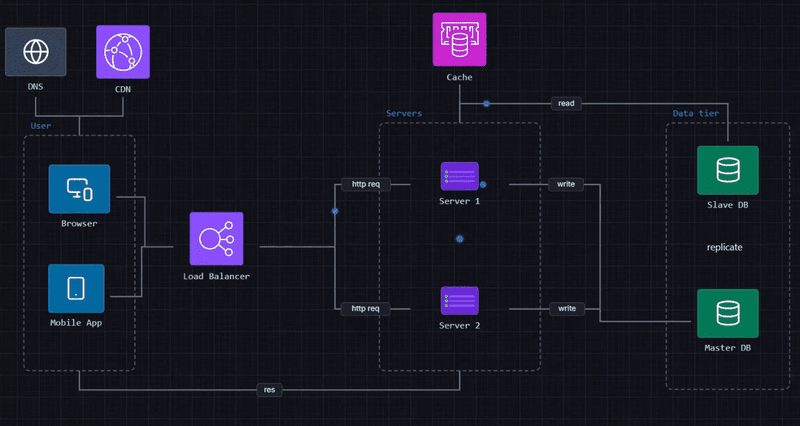
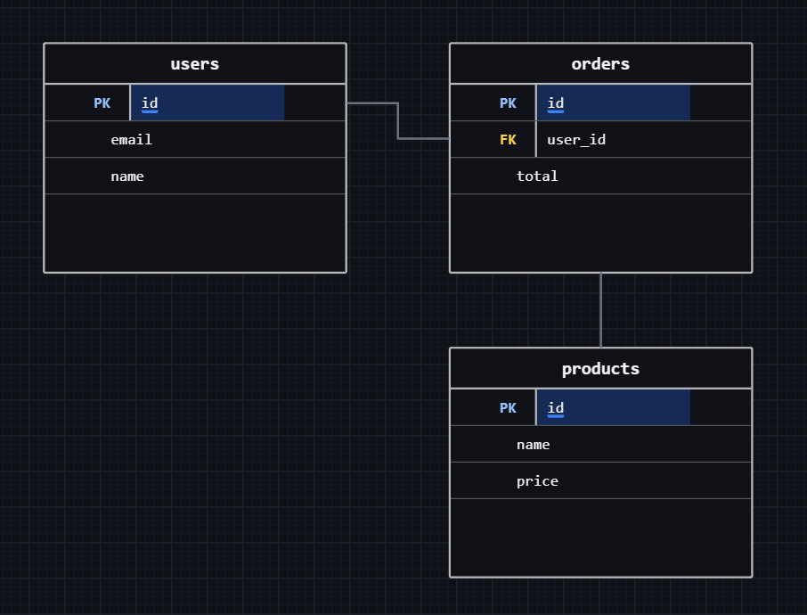
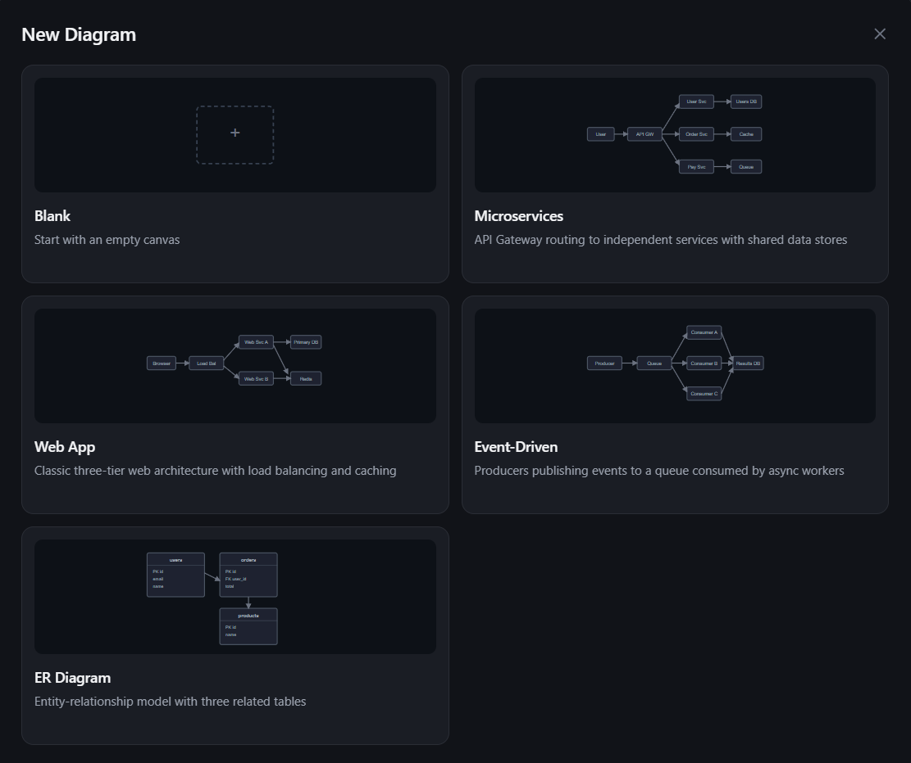

# NX-Design

**A system design visualizer where you can visualize data flows.** Drag components onto a canvas, connect them, and animated flow bubbles travel along each connection so the path of a request is visible at a glance.

**Live app:** [nxdesign.app](https://nxdesign.app)



## Overview

A static diagram shows what a system is made of. A system design is about movement: a request leaves a client, passes through a load balancer, hits a service, and lands in a database. NX-Design draws the boxes and arrows, then animates the flow across them, so the diagram shows how the system behaves.

It is a full-stack product, not a canvas demo: accounts, cloud-saved diagrams, a free and a paid plan, and transactional email are all live.

## Features

### Canvas

- **67 system design blocks in 11 categories**: clients, compute, storage, caching, messaging, networking, security, observability, data processing, external services, and entity-relation tables
- **HTTP helpers**: method badges (GET through OPTIONS) and status-code groups (1xx to 5xx)
- **Drag and drop** from a searchable side panel
- **Smart connection routing**: connections run at right angles and route around other components
- **Animated data flow**: bubbles travel each chain of connections from its source, splitting at branches; toggle it on or off at any time
- **Connection labels** for naming what travels along a path
- **Frames** to group components (a region, a VPC, a service boundary), plus shapes and text blocks
- **Multi-select, align, distribute, snap to grid, resize, copy and paste, and undo**
- **Pan and zoom** from 25% to 400%, zooming toward the cursor

### ER diagrams

- Table components with primary-key and foreign-key rows
- Row-to-row connections with **crow's-foot cardinality**, set independently at each end (one, many, zero or one, one or many, and so on)



### Diagrams and accounts

- **Multiple diagrams in tabs**, each renamable
- **Starter templates**: Microservices, Web App, Event-Driven, and ER Diagram
- **Cloud save** with auto-save or manual save, and a local copy in the browser for crash recovery
- **PNG export**
- **Sign in** with Google, GitHub, or email and password, with email verification and password reset
- **Free plan** (one diagram) and **Pro plan** (unlimited diagrams) through Stripe Checkout, with a self-service billing portal



## Using the app

1. **Sign in** at [nxdesign.app](https://nxdesign.app) and open the canvas. The canvas needs a desktop-width browser.
2. **Pick a template** or start blank.
3. **Add components** by dragging them from the left panel. Use the search box to find one by name.
4. **Connect them** by hovering a component, then dragging from one of its edge ports to another component. A flow bubble starts travelling the new path.
5. **Organize** with frames (`F`), text (`T`), and shapes (`U`). Double-click any label to rename it.
6. **Model a database** by connecting rows of two Table components, then selecting the connection to set cardinality at each end.
7. **Export** the finished diagram with the Export PNG button.

### Keyboard shortcuts

| Key | Action |
|---|---|
| `V` | Select tool |
| `F` | Frame tool |
| `T` | Text block tool |
| `U` | Shape tool |
| `A` | Toggle data flow animation |
| `Space` + drag | Pan the canvas |
| Scroll | Zoom in and out |
| `Ctrl/Cmd` + `Z` | Undo |
| `Ctrl/Cmd` + `C` / `V` | Copy / paste |
| `Delete` / `Backspace` | Delete selection |
| `?` | Show the shortcuts overlay |
| `Esc` | Deselect or close |

## Tech stack

| Layer | Technology |
|---|---|
| Framework | Next.js 15 (App Router), React 19 |
| Language | TypeScript (strict, with `noUncheckedIndexedAccess`) |
| Styling | Tailwind CSS 3 |
| Animation | Framer Motion |
| Database | PostgreSQL with Prisma 7 |
| Auth | Auth.js (NextAuth v5): Google, GitHub, and credentials |
| Payments | Stripe Checkout and Customer Portal |
| Email | Resend |
| Rate limiting | Upstash Redis |
| Validation | Zod |
| Hosting | Vercel |

The canvas has no diagramming or state-management library behind it. Rendering, routing, selection, and history are built from React, SVG, and custom hooks.

## Architecture

```
app/                  Routes, layouts, and API route handlers
  api/                auth, diagrams, register, stripe, feedback, user
  canvas/             The editor (requires a signed-in, verified user)
components/
  features/           canvas, blocks, side-panel, inspector, header, billing, landing, ...
  ui/                 Reusable primitives (tooltip, icon button, inputs)
hooks/                Canvas behaviour, one concern per hook
lib/                  Block registry, routing, flow, templates, db, stripe, email
prisma/               Schema and migrations
auth.ts               Auth.js configuration
middleware.ts         API rate limiting
```

A few decisions worth pointing out:

- **Data-driven block registry.** Every block is one entry in [lib/block-registry.ts](lib/block-registry.ts) (label, category, icon, appearance). The side panel, canvas, and templates all read from it, so adding a component is a data change with no new rendering code.
- **Connection routing.** [lib/connection-utils.ts](lib/connection-utils.ts) computes right-angle paths between ports and steers them around other components' bounding boxes.
- **Flow animation.** [lib/flow-chain.ts](lib/flow-chain.ts) walks the connection graph from every component with no incoming connection and builds the chains the bubbles follow, giving each branch its own bubble.
- **One hook per interaction.** Pan and zoom, drag and drop, connection dragging, marquee selection, frame and shape drawing, clipboard, and diagram persistence each live in their own hook under [hooks/](hooks/). Canvas state is a reducer in `use-placed-components`.
- **Persistence.** The server is the source of truth. Diagrams are stored as JSON in Postgres through `/api/diagrams`, and every write is validated with a Zod schema ([lib/diagram-schema.ts](lib/diagram-schema.ts)). `localStorage` is a per-user cache for crash recovery.
- **Plan limits enforced on the server.** The diagram API checks the user's tier on write, and the Stripe webhook is the only thing that changes a tier.
- **Rate limiting in middleware.** [middleware.ts](middleware.ts) applies sliding-window limits to every API route, with a stricter limit on routes that send email.

## Roadmap

- **Shareable links**: publish a diagram as a read-only page
- **Team plan**: shared workspaces, invitations, and real-time collaboration

Current limitations: undo has no redo yet, export is PNG only, and the canvas is desktop only.

## Links

- Live app: [nxdesign.app](https://nxdesign.app)
- Changelog: [nxdesign.app/changelog](https://nxdesign.app/changelog)
